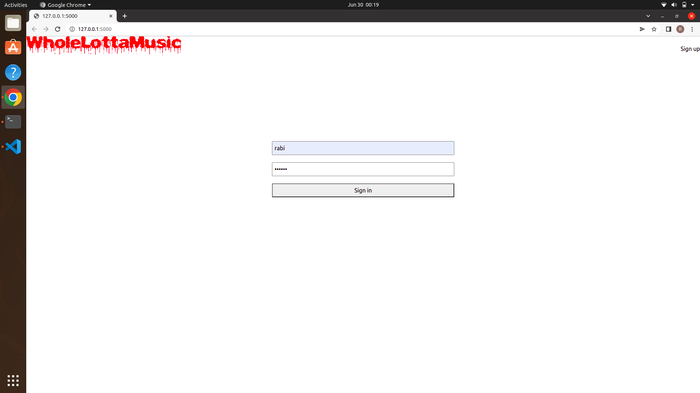
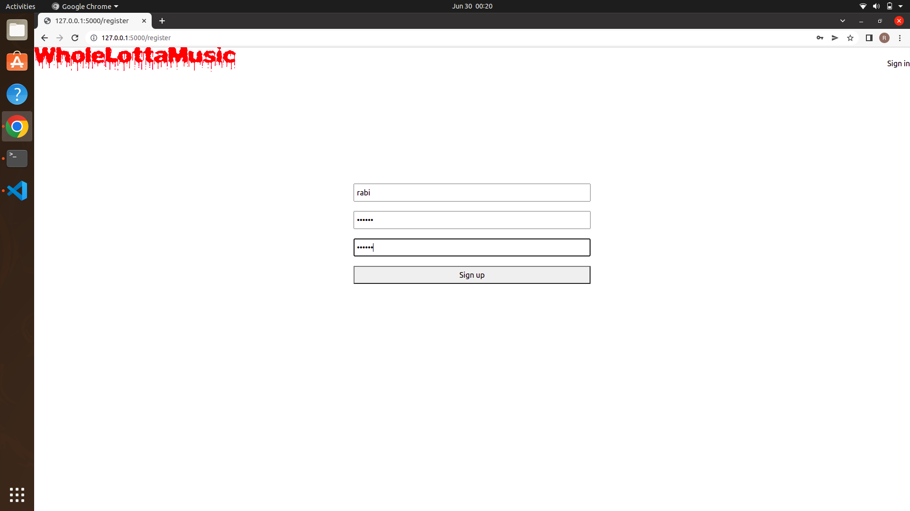
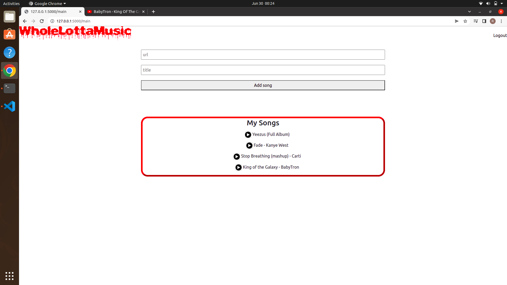

# Music Player Web Aplication
A flask web application where users can save their favorite music from different streaming platforms

    <li>Login Page</li>
    
  <li>Registration page</li>
    
  <li>Main application</li>
    

## Installation
- install python
~~~
$ sudo apt-get update
$ sudo apt-get install python3.6
~~~
- create and activate virtual environment
~~~
$ pip install virtualenv
$ virtualenv venv
$ source venv/bin/activate
~~~
- install flask
~~~
$ sudo apt install python3-flask
~~~
- run application
~~~
$ flask run
~~~
## Features to implement
<ol>
<li>Let users edit song titles</li>
<li>Add a save button for each song entry that saves mp3 file to local computer</li>
<li>Add a save all button that saves all song entries as a directory on your local comuter</li>
<li>Add a background of album covers across all pages</li>
<li>Have popup website be in a div, not a new tab</li>
</ol>
